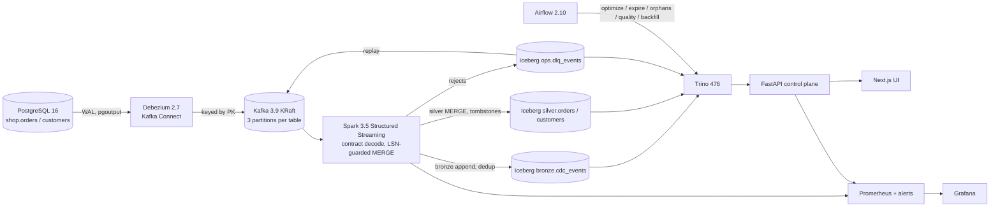

# LakeFlow: CDC lakehouse with verifiable delivery semantics

**LakeFlow streams every change in a PostgreSQL database into an Apache Iceberg lakehouse within seconds.**
Duplicates, retries, crashes, late events and schema drift must not corrupt the result. The project also
ships the tests, benchmarks and UI that prove that claim. The path is PostgreSQL → Debezium → Kafka → Spark
Structured Streaming → Iceberg on MinIO → Trino. Around it sit a FastAPI + Next.js control plane, Airflow
maintenance and Prometheus/Grafana.

[](https://github.com/Charanloyal/lakeflow/actions/workflows/ci.yml)

## Demo

| | |
|---|---|
| **Recorded demo (no install):** https://charanloyal.github.io/lakeflow/ | The real UI, showing API responses captured from the real stack during the CI end-to-end run. It is read-only, says so on every page, and links the CI run that produced it. |
| **Live stack in your browser:** [](https://codespaces.new/Charanloyal/lakeflow?quickstart=1) | A 4-core/16 GB Codespace starts the full stack automatically (about 8 minutes on first boot) and opens the UI. Log in with `admin` / `local-only-admin`. |
| **Locally:** see the [5-minute quick start](#5-minute-quick-start) | Docker only. |


## Architecture



- **Catalog.** An Iceberg REST catalog backed by PostgreSQL. Spark writes and Trino reads through the same catalog.
  There is no second source of truth.
- **Contracts.** [`contracts/`](contracts/) holds the contracts: JSON Schema 2020-12 plus lakehouse metadata
  (primary key, target table, PII policy, freshness SLA). The single decoder in
  [`libs/lakeflow_core`](libs/lakeflow_core/) validates every event, and Spark, the API and the tests all use that
  decoder.

## 5-minute quick start

Requirements: Docker with at least 6 GB of memory (`8gb` profile) or 11 GB (`16gb` profile, which adds Airflow,
Prometheus and Grafana).

```bash
make bootstrap PROFILE=8gb   # generates .env secrets, pulls/builds images
make up PROFILE=8gb          # waits until every service is healthy, prints URLs
make demo                    # insert -> update -> crash Spark -> delete, with real LSNs, offsets, snapshot ids
```

Open http://localhost:8080 and log in as `admin` / `local-only-admin`. Every port binds to 127.0.0.1.
Without `make` (for example on Windows), use `python scripts/lakeflowctl.py <command>`.
`make test`, `make integration-test`, `make benchmark`, `make maintenance` and `make down` do what their names
say.

## Walkthrough (what to click)

1. **Overview → Guided demo.** It inserts, updates and deletes an order. The trace timeline shows each hop with
   its real identifier: PostgreSQL txid and LSN, Kafka partition and offset, Spark batch id, Iceberg snapshot id,
   the Trino query, and the checkpoint commit.
2. **Recovery Lab.**
   - Inject duplicates, malformed records or late events, and watch them get absorbed.
   - Arm *crash after commit*. Spark dies after the Iceberg commit but before the offset commit, restarts,
     replays the batch (`attempts = 2`), and still produces no duplicates.
3. **Data Quality.**
   - Contract checks run live in Trino, including a row-for-row reconciliation of silver against PostgreSQL.
   - The DLQ with the exact rejected bytes, plus one-click replay.
   - The JPY contract-drift scenario (source accepts JPY, contract v2 rejects it, proposed v3 fixes it).
4. **Lineage, Benchmarks, Architecture.** Dataset lineage with live statistics. Benchmark summaries are recomputed
   from raw samples. All ADRs are browsable.

## Benchmarks

`make benchmark` (and CI, on every push) runs a **seeded workload of real PostgreSQL transactions**: 60 % insert,
30 % update, 10 % delete, isolated per iteration by its own customer. It measures only what arrives in Iceberg,
reading it back through Trino ([ADR-0005](docs/adr/0005-benchmark-methodology.md)).

| Metric | Definition | CI gate |
|---|---|---|
| Freshness p50/p95/p99 | bronze Iceberg commit − PostgreSQL commit, per event | p95 ≤ 60 s |
| Throughput | events ÷ (last commit − first source commit), per iteration | ≥ 2 events/s (a breakage floor, not a claim) |
| Loss / duplicates / errors | vs. the changes the runner actually committed | 0 / 0 / 0 |
| Reconciliation | silver rows ≠ PostgreSQL rows after the run | 0 |
| Query | the *same* Trino query before and after `optimize`, cold and warm runs, and an identical-result check | recorded |

The numbers depend on hardware, so this README deliberately contains none. Every run stores its environment (CPU,
memory, container limits, trigger interval, partitions, Iceberg properties, CI run URL) and every raw latency
sample in `benchmarks/results/*.json`. The **Benchmarks** page recomputes all summaries from those samples.
Local-mode Spark with a 5 s trigger puts a floor of roughly one trigger interval plus commit time on freshness. That
is a property of the design, and the benchmark reports it.

## Reliability: what is guaranteed, and how it is proven

| Failure | Behavior | Proof (executed in CI against the real stack) |
|---|---|---|
| Kafka redelivery / duplicate events | Bronze keeps one row per `event_id`; silver is unchanged | `test_03_redelivered_events_are_absorbed` |
| Out-of-order or late update | The LSN guard rejects it as `stale`; it is stored in bronze for audit | `test_04_out_of_order_update_is_stale_and_late` |
| Malformed or contract-violating record | DLQ with a reason code and the raw bytes; the stream continues | `test_05`, Recovery Lab e2e |
| Spark crash after the Iceberg commit, before the offset commit | The batch is replayed idempotently (`attempts ≥ 2`, no duplicates) | `test_06`, `test_crash_after_commit_is_recovered_without_duplicates` |
| Debezium connector restart | Resumes from its committed LSN; nothing is lost | `test_07` |
| Schema evolution / contract drift | Additive v2 applied automatically; JPY rejected, then promoted in v3 and replayed | `test_08`, `test_09` |
| Compaction while streaming | Content fingerprint of the rewrite equals its parent; the stream keeps committing | `test_compaction_while_streaming_preserves_content` |

Backfill through Debezium incremental snapshots (`make backfill`, the `lakeflow_backfill` DAG) is implemented but
**experimental**: its end-to-end test is marked as an expected failure until CI proves it.

This is *effectively-once* state, not transactional exactly-once delivery. Kafka delivers at least once, and the
sink makes every replay idempotent. The trade-offs are in
[ADR-0003](docs/adr/0003-delivery-semantics.md). Runbooks: [stream recovery](docs/runbooks/stream-recovery.md),
[DLQ replay](docs/runbooks/dlq-replay.md), [maintenance and backfill](docs/runbooks/maintenance.md).

## Design decisions

| ADR | Decision |
|---|---|
| [0001](docs/adr/0001-kafka-partitioning.md) | Kafka keys, partitions and retention: per-key ordering, topics as code |
| [0002](docs/adr/0002-iceberg-partitioning.md) | Iceberg layout: `bucket(4, pk)` silver with merge-on-read, `days(source_ts)` bronze |
| [0003](docs/adr/0003-delivery-semantics.md) | End-to-end delivery and deduplication semantics |
| [0004](docs/adr/0004-schema-compatibility.md) | Contracts, backward-transitive compatibility, PII (HMAC / drop) |
| [0005](docs/adr/0005-benchmark-methodology.md) | Benchmark methodology: real stack, raw samples, recomputed summaries |

## Security and limitations

- Secrets are generated per checkout by `make bootstrap`. Nothing secret is committed, and a CI test scans for it.
- Every service binds to 127.0.0.1. UI sessions use an HttpOnly, SameSite=Strict HMAC cookie with a CSRF header
  on writes. There are two roles: viewer and admin (required for mutations and fault injection). Fault injection
  is bounded and audited.
- PII: e-mail addresses are HMAC-pseudonymized and full names are dropped before they reach the lakehouse
  (per contract).
- This is a **single-node demo**, not a production deployment:
  - Spark runs `local[2]` and MinIO is a single node.
  - There is no TLS, SSO or multi-tenant isolation.
  - Retention is shortened to 1 h for laptops.

  Details are in [docs/security.md](docs/security.md) and [docs/troubleshooting.md](docs/troubleshooting.md).
- The recorded demo site is a snapshot of one CI run, not a live system. Use Codespaces for the live stack.

## Roadmap

- Soak tests (hours) and failure injection under sustained load; results published with the same raw-sample
  schema.
- Kubernetes deployment (Spark operator, multi-node MinIO), TLS and OIDC.
- Per-table SLO burn-rate alerts, and OpenLineage events from Spark and Airflow.

## What I personally designed and implemented

> **Edit this section in your own words before sharing the repository.** Recruiters value an honest account more
> than a long one. State what you designed, what you debugged, and which tools (including AI assistants) helped.

- *Architecture and trade-offs I chose:* …
- *Hardest bug I diagnosed:* … (for example, `foreachBatch` running in a cloned Spark session, so temp views were
  invisible to the driver session)
- *What I would do differently in production:* …
- *AI assistance:* this rebuild was developed with an AI coding assistant. I reviewed and ran the code, and CI
  validates it against the real stack.

---

v1 of this repository was a static simulation with fabricated benchmark numbers. It is preserved at tag
`archive/v1-simulation`, and the audit that replaced it is in
[docs/audit/2026-09-25-repository-audit.md](docs/audit/2026-09-25-repository-audit.md).
