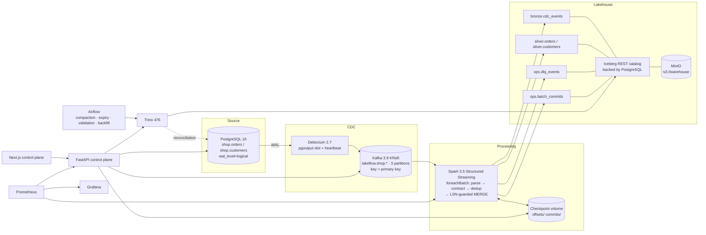

# Repository audit and rebuild plan (2026-09-25)

Audited revision: `44945c1` (`main`, 2026-09-24). This is the Milestone 0 deliverable. It records what I found,
what I kept, and how the rebuild is ordered. Later milestones say what changed and how it was validated.

## 1. Findings that drove the rebuild

| # | Finding | Evidence | Impact |
|---|---------|----------|--------|
| F1 | The public site (`apps/web`, `docs/`, Render, GitHub Pages) is a static JavaScript simulation. It makes no network calls, but it shows "live" and "HEALTHY" states. | `apps/web/app.js` has no `fetch` or WebSocket usage. | Recruiters see invented metrics. |
| F2 | The headline benchmark (2.01 M events at 423,062 events/s) was measured on a pure-Python loop over dicts and sets. It never touches Kafka, Spark, or Iceberg. Its "75.4x faster" figure compares two different queries. | `apps/benchmarks/benchmark_engine.py`, `lakeflow/benchmarks/*` | These claims can't be defended. |
| F3 | The Spark job is never submitted. The compose file starts an idle master and worker, and the image has no Kafka or Iceberg jars. | `docker-compose.yml`, `apps/streaming/lakeflow_stream_v2.py` | No data reaches the lakehouse. |
| F4 | Spark uses a `hadoop` Iceberg catalog. Trino uses `iceberg.catalog.type=rest`, but no `iceberg.rest-catalog.uri` is set. | `apps/streaming/...:67`, `config/trino/catalog/iceberg.properties` | Trino's catalog cannot load, and the engines can never share tables. |
| F5 | The seed SQL uses non-hex UUID literals (`p2000000-...`, `o3000000-...`, `i4000000-...`). | `config/postgres/02-ecommerce-schema.sql` | PostgreSQL init aborts, so there is no source data. |
| F6 | The job calls `withWatermark(...).dropDuplicates(["record_key","source_lsn"])` without the event-time column in the keys. | streaming job | Dedup state is never evicted and grows without bound. |
| F7 | `maxOffsetsPerTrigger=50000` with a 5 s trigger caps throughput at about 10k events/s. That contradicts F2. | streaming job | The claims are inconsistent. |
| F8 | "Exactly-once" is claimed without qualification. The sink is a plain append, which duplicates rows when a batch is replayed. | README, streaming job | The claim is incorrect. |
| F9 | Secrets are hard-coded. The Debezium password is in the connector JSON, the Airflow Fernet key is committed and reused as the compose default, and MinIO uses a well-known default password. | `.env.example`, `docker-compose.yml`, connector JSON | Every installation shares the same keys. |
| F10 | Tests assert constants or simulation outputs. | `tests/test_production_readiness.py`, `tests/test_lakeflow_modules.py` | Test success means nothing. |
| F11 | FeatureHub reports AUC 1.0 because its features are conditioned on the label. The Redis store falls back to an in-memory dict without saying so. | `featurehub/offline/data_generator.py`, `featurehub/online/redis_store.py` | It is not credible and not part of the CDC path. |
| F12 | Pinned images are no longer published: `minio/minio` is gone from Docker Hub and Quay requires auth, and the Bitnami catalog was retired. The `debezium/connect` Docker Hub location is deprecated. | Registry API checks, 2026-09-25 | `docker compose up` cannot pull today. |
| F13 | The Pages workflow fails because Pages is not enabled. | Actions run `36050436175` | CI is red on `main`. |

## 2. Keep / refactor / remove inventory

| Path (at `44945c1`) | Decision | Replacement or reason |
|---|---|---|
| `docker-compose.yml` | **Refactor** | KRaft Kafka, PostgreSQL 16, and Trino are kept. The idle Spark cluster and Redis are dropped. Added: a REST catalog, the Spark job container, the API, the web UI, profiles, health checks, and limits. |
| `config/postgres/*.sql` | **Refactor** → `platform/postgres/init/` | Roles and passwords come from env. Valid UUIDs. Added heartbeat and signal tables, separate databases, and least-privilege grants. |
| `config/debezium/postgres-source-connector.json` | **Refactor** → `platform/debezium/` | `${env:...}` secrets, heartbeat action query, `decimal.handling.mode=string`, and a signal table. |
| `config/trino/*` | **Refactor** → `platform/trino/` | REST catalog with a URI, native S3, `${ENV:...}` secrets, and a PostgreSQL catalog for reconciliation. |
| `config/prometheus`, `config/grafana` | **Refactor** → `observability/` | Real scrape targets, alert rules, and a provisioned dashboard. |
| `apps/streaming/lakeflow_stream_v2.py` | **Replace** → `spark/lakeflow_stream/` | Idempotent `foreachBatch` MERGE with an LSN guard, a DLQ, and contract validation. |
| `Makefile`, `.env.example`, `.gitignore` | **Refactor** | Required targets, generated local secrets, and ignore rules. |
| `scripts/register_connector.py`, `scripts/verify_health.py` | **Replace** | `connect-init` container and `scripts/lakeflowctl.py doctor`. |
| `apps/web/*`, `docs/{app.js,index.html,style.css}`, `run_app.py`, `Dockerfile`, `render.yaml`, `.github/workflows/deploy-pages.yml` | **Remove** | Simulation that presented invented metrics (F1, F13). |
| `apps/dashboard/*`, `apps/api/main.py`, `lakeflow/api/main.py` | **Remove** | Hard-coded metrics (`423062.0`, "100% Exactly-Once"). |
| `apps/benchmarks/*`, `lakeflow/benchmarks/*` | **Remove** | Fabricated benchmark (F2). Replaced by `benchmarks/`. |
| `lakeflow/{ingestion,streaming,lakehouse,analytics}` | **Remove** | Simulation stubs. The real logic lives in `libs/lakeflow_core`, `spark/`, and `api/`. |
| `tests/*` | **Remove** | Tautological (F10). Replaced by unit, Spark, integration, e2e, and UI suites. |
| `featurehub/`, `dags/featurehub_materialize_dag.py`, `apps/dashboard/featurehub_dashboard.py` | **Remove from `main`** | F11. Preserved at tag `archive/v1-simulation`. It can come back as an optional module fed by silver tables with leakage-safe features. |
| DataGuard | **Not implemented** | Only a README mention existed. The core data-quality path covers contracts and checks; an optional module is on the roadmap. |
| `make.ps1`, `scripts/setup.*`, `scripts/demo.py`, `requirements.txt` | **Remove** | Replaced by `scripts/lakeflowctl.py`, which is cross-platform Python. |

## 3. Target architecture



## 4. Phased plan

Each milestone exits only when it passes an executable check. The development desktop has no Docker, Node, or
Java, so every container and browser check runs in GitHub Actions and is linked from the milestone notes.

| Milestone | Scope | Exit criteria (executable) | Main risks |
|---|---|---|---|
| M0 | Audit, removals, repo hygiene | The hygiene test suite passes (banned claims, secret patterns) | None |
| M1 | Contracts, core library, PostgreSQL → Debezium → Kafka → Spark → Iceberg → Trino | Unit + PySpark semantics tests. A CI compose run traces insert/update/delete to Trino with real IDs. Crash-after-commit recovery leaves no duplicates. | No local Docker, so CI round trips are slow. Upstream images are archived or frozen (Iceberg REST, MinIO). |
| M2 | FastAPI control plane (typed endpoints, auth, SSE, recovery lab) | API unit tests + integration tests against the running stack | Background consumer lifecycle |
| M3 | Next.js control plane (8 pages, guided demo, all data states) | Lint, typecheck, and build + Playwright against the live stack + screenshots | No local Node, so no committed lockfile until CI generates it |
| M4 | Airflow DAGs, Prometheus rules, Grafana | DAG import tests + maintenance functions run against Trino in CI + Prometheus targets up | RAM on 8 GB laptops (Airflow is opt-in) |
| M5 | Deterministic benchmark harness + CI regression gate | Raw JSON from CI runs committed with the run URL. The UI reads those files. | CI noise, so thresholds are deliberately loose |
| M6 | README, ADRs, security posture, scanning | Security jobs (gitleaks, pip-audit, npm audit, Trivy) run on every push | Findings in upstream images (reported, not suppressed) |
| M7 (optional) | FeatureHub, DataGuard | Out of scope until M1–M6 are green | None |

## 5. Folder structure

```text
contracts/            versioned JSON Schema contracts, examples, compatibility rules
libs/lakeflow_core/   shared pure-Python logic (contract engine, event identity, stats, lineage, quality SQL)
platform/             service configuration: postgres, kafka topics, debezium, trino
spark/                streaming job package, image, PySpark tests
api/                  FastAPI control plane (routers, services, clients, tests)
frontend/             Next.js (static export) served by nginx, Playwright tests
airflow/              maintenance, validation, backfill and replay DAGs + image
observability/        Prometheus config and alerts, Grafana provisioning and dashboards
benchmarks/           deterministic workload generator, runner, thresholds, results/*.json
tests/                unit (stdlib-compatible), integration, e2e scenario suites
infra/                compose resource profiles (8 GB / 16 GB)
scripts/              lakeflowctl.py (bootstrap/up/demo/down/doctor)
sample-data/          seed data and sample Debezium envelopes
docs/                 architecture, ADRs, runbooks, troubleshooting, security, this audit
```

## 6. API contracts (summary)

All endpoints live under `/api`. Every metric response carries `as_of`, `source`, and `stale`. Mutating endpoints need the
`admin` role and the `X-LakeFlow-CSRF` header when a browser session is used. `docs/api.md` is the full reference, and
the live OpenAPI document is served at `/api/openapi.json`.

| Method | Path | Purpose |
|---|---|---|
| GET | `/api/health` | Liveness (no auth) |
| GET | `/api/health/components` | Per-component probe result, latency, timestamp |
| POST | `/api/auth/login`, `/api/auth/logout`; GET `/api/auth/me` | Session cookie login for the UI |
| GET | `/api/topology` | Stage graph with live status and lag |
| GET | `/api/metrics/overview` | Throughput, p95 freshness, lag, error rate, SLA, incidents |
| GET | `/api/metrics/batches` | Recent micro-batches (ops.batch_commits) |
| GET | `/api/events` | Event explorer (filters: table, key, op, outcome, since) |
| GET | `/api/trace/{table}/{key}` | Record-level timeline across every stage |
| POST/PATCH/DELETE | `/api/demo/orders[/{id}]` | Controlled source mutations |
| POST | `/api/demo/mutations` | Seeded batch of mutations (bounded) |
| GET | `/api/quality/summary`, `/api/quality/rejected`, `/api/quality/schema`, `/api/quality/freshness` | Data quality views |
| POST | `/api/quality/run`, `/api/quality/dlq/replay` | Run checks now, replay DLQ records |
| GET | `/api/lineage`, `/api/lineage/impact?dataset=` | Dependency graph and impact analysis |
| GET | `/api/benchmarks/runs`, `/api/benchmarks/runs/{id}`, `/api/benchmarks/runs/{id}/raw` | Benchmark history computed from raw JSON |
| GET/POST | `/api/recovery/actions` | Recovery lab (inject duplicate, malformed, or late events; crash Spark; restart connector) |
| GET | `/api/architecture/adrs` | ADRs parsed from `docs/adr` |
| GET | `/api/stream/live` | Server-sent events for topology and trace updates |
